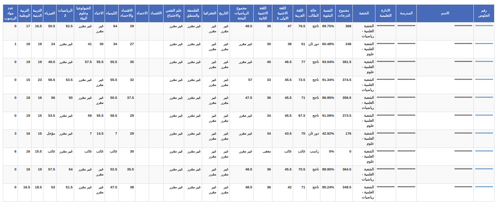

# Fetch Natega of Thanawya and sort results

## Usage
Clone this repo then install dependencies
```bash
npm install --production
```
Use **fetch.js** command and pass seatNumber and count, for example
```bash
./fetch.js -s 1234 -c 10
```
This will fetch results for seat numbers from 1234 to 1244, results will be saved at **dist/results.js** as global variable with name **results**

Open **index.html** in the browser

## Screenshot of results
 

## Features
- Sort by subject or total degree

## Modify App.js
If you want to modify app.js you should run
```bash
npm install ## install devDependencies
npm run build
```

##Share results
All you need is **index.html** and **dist** directory
